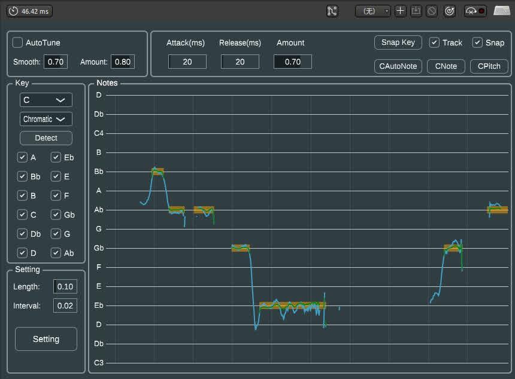

# MXTune

> An open-source real-time pitch correction plugin based on Tom Baran's Autotalent.

MXTune is a cross-platform pitch correction plugin featuring a piano-roll style editor for manual pitch editing. It supports real-time tuning while allowing notes to be added, edited, and removed directly from the interface.

> **Note**
> This repository is an updated fork of the [original MXTune project](https://github.com/liuanlin-mx/mxtune) by liuanlin-mx.

---



---

## Features

- 🎵 Real-time pitch correction
- ✏️ Piano-roll style note editor
- 🎹 MIDI input support
- 🖥️ Cross-platform builds
  - Windows
  - macOS
  - Linux
- 🔧 CMake build system

---

# Keyboard & Mouse Shortcuts

| Action | Shortcut |
| :--- | :--- |
| Horizontal Zoom | <kbd>Alt</kbd> + Mouse Wheel |
| Vertical Zoom | <kbd>Ctrl</kbd> + Mouse Wheel |
| Move Vertically | Mouse Wheel or <kbd>W</kbd> / <kbd>S</kbd> |
| Move Horizontally | <kbd>Shift</kbd> + Mouse Wheel or <kbd>A</kbd> / <kbd>D</kbd> |
| Add Note | Left Mouse Drag |
| Delete Note | Right Mouse Button |

---

# Building

MXTune uses CMake and depends on several third-party audio libraries.

## Linux

Linux builds are fully automated.

Install the required FFTW package:

```bash
sudo apt install libfftw3-dev
```

Run the build script:

```bash
./build_linux.sh
```

The script will automatically build:

- libsamplerate
- aubio
- SoundTouch
- Rubber Band
- JUCE
- MXTune

---

## Windows (MSYS2)

### Install dependencies

```bash
pacman -S mingw-w64-x86_64-toolchain
pacman -S make cmake autoconf automake-wrapper libtool \
    mingw-w64-x86_64-python3 \
    mingw-w64-x86_64-waf \
    mingw-w64-x86_64-fftw \
    mingw-w64-x86_64-rubberband
```

### Configure JUCE

Download **JUCE 5.4.7**.

#### Required modifications

**`JUCE/modules/juce_audio_plugin_client/VST/juce_VST_Wrapper.cpp`**

Comment out:

```cpp
extern "C" BOOL WINAPI DllMain (HINSTANCE instance, DWORD reason, LPVOID)
{
    if (reason == DLL_PROCESS_ATTACH)
        Process::setCurrentModuleInstanceHandle (instance);
    return true;
}
```

**`JUCE/modules/juce_audio_plugin_client/VST3/juce_VST3_Wrapper.cpp`**

Ensure:

```cpp
extern "C" __declspec (dllexport)
IPluginFactory* GetPluginFactory()
```

Run **Projucer**:

1. Open `JUCE/mx_tune.jucer`
2. Open **File → Global Paths**
3. Set:
   - Path to JUCE
   - JUCE Modules
4. Save All

---

### Configure the VST SDK

Download the Steinberg VST SDK.

Copy:

```
vstsdk2.4/pluginterfaces
```

into

```
VST_SDK/VST3_SDK/
```

Then copy the complete `VST3_SDK` directory into the MXTune source tree.

Modify:

**`VST3_SDK/base/source/fstring.cpp`**

```cpp
#define vsnprintf _vsnprintf
```

↓

```cpp
//#define vsnprintf _vsnprintf
```

Ensure:

**`VST3_SDK/pluginterfaces/base/ipluginbase.h`**

contains

```cpp
extern "C" __declspec (dllexport)
Steinberg::IPluginFactory* GetPluginFactory();
```

---

### Build SoundTouch

```bash
./bootstrap

./configure \
    --prefix=/mingw64 \
    --enable-static \
    --disable-shared

make CXXFLAGS="-DSOUNDTOUCH_PREVENT_CLICK_AT_RATE_CROSSOVER=1"

make install
```

---

### Build aubio

```bash
python3 /mingw64/bin/waf configure \
    --enable-fftw3f \
    --disable-tests \
    --disable-examples \
    --disable-wavread \
    --disable-wavwrite \
    --prefix=/mingw64

python /mingw64/bin/waf install -j4
```

---

### Build MXTune

```bash
mkdir build-cmake
cd build-cmake

cmake .. \
    -DCMAKE_CXX_COMPILER=g++ \
    -DCMAKE_C_COMPILER=gcc \
    -G "Unix Makefiles"

make -j4
```

---

## macOS

### Prerequisites

- Xcode
- Xcode Command Line Tools
- Homebrew
- CMake
- Git

Install the command line tools:

```bash
xcode-select --install
```

Install dependencies:

```bash
brew install pkg-config autoconf automake libtool cmake
```

---

### Configure JUCE

Download **JUCE 7.0.5**.

Run **Projucer**:

1. Open `JUCE/mx_tune.jucer`
2. Configure the Global Paths
3. Save All

---

### Configure the VST SDK

Download the Steinberg VST SDK.

Copy

```
vstsdk2.4/pluginterfaces
```

into

```
VST_SDK/VST3_SDK/
```

Then copy `VST3_SDK` into the MXTune project.

---

### Build audio dependencies

```bash
./configure --enable-static --enable-float --enable-single

./waf configure \
    --enable-fftw3f \
    --disable-tests \
    --disable-examples \
    --disable-wavread \
    --disable-wavwrite \
    --notest

sudo ./waf install
```

---

### Build SoundTouch

```bash
make CXXFLAGS="-DSOUNDTOUCH_PREVENT_CLICK_AT_RATE_CROSSOVER=1 \
-fdata-sections \
-ffunction-sections"

sudo make install
```

---

### Build Rubber Band

```bash
make -f otherbuilds/Makefile.macos

sudo cp -R rubberband /usr/local/include
sudo cp lib/* /usr/local/lib
sudo cp build/meson-private/rubberband.pc \
    /usr/local/lib/pkgconfig/
```

---

### Build MXTune

```bash
mkdir build-cmake
cd build-cmake

cmake ..

make -j6

sudo cp libmx_tune.dylib \
    /Library/Audio/Plug-Ins/VST/mx_tune.vst
```

---

# Credits

MXTune builds upon several excellent open-source projects.

### Autotalent

The core pitch detection and correction algorithms are derived from **Tom Baran's Autotalent**, including:

- `pitch_detector_talent.cpp`
- `pitch_shifter_talent.cpp`
- `auto_tune.cpp`

Original project:

http://web.mit.edu/tbaran/www/autotalent.html

---

### TalentedHack

http://code.google.com/p/talentledhack/

---

### JUCE

MXTune uses the JUCE framework.

JUCE is licensed under the GPL v3 or a commercial license.

For licensing details, visit:

https://juce.com
